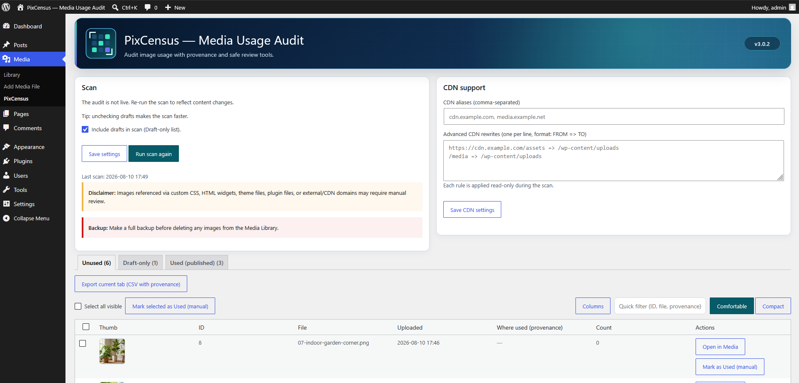
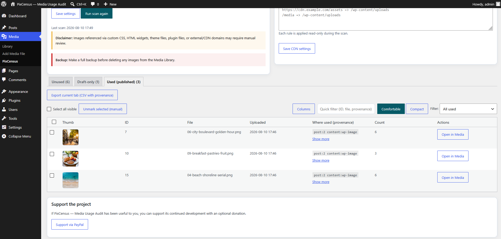
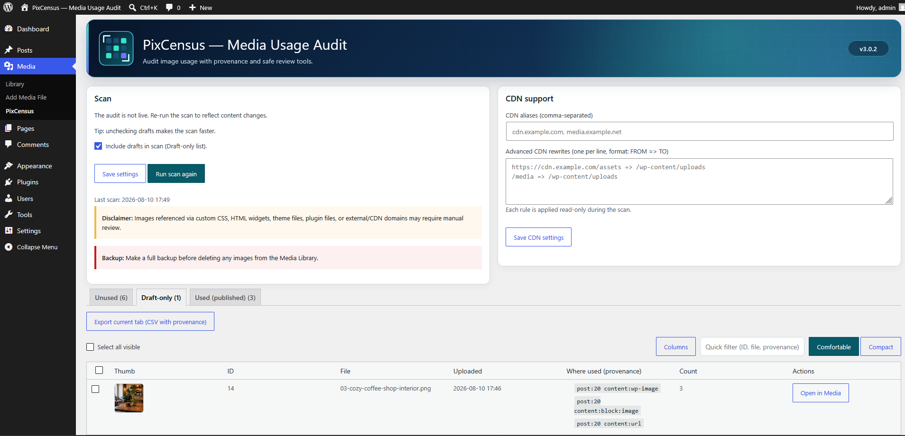
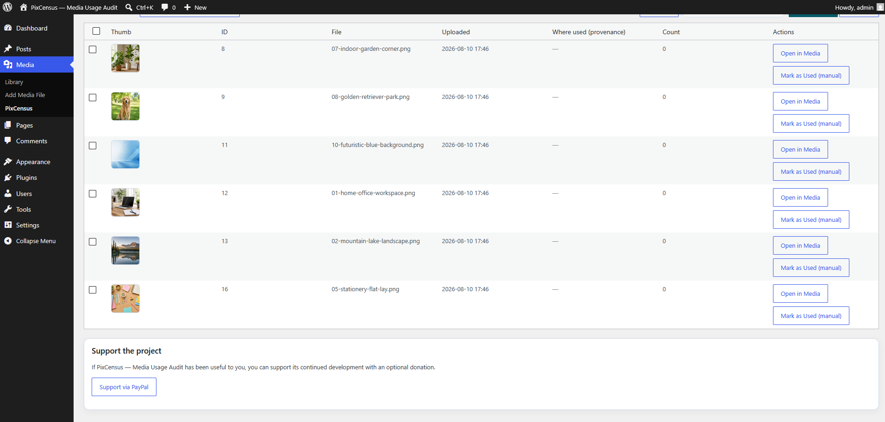
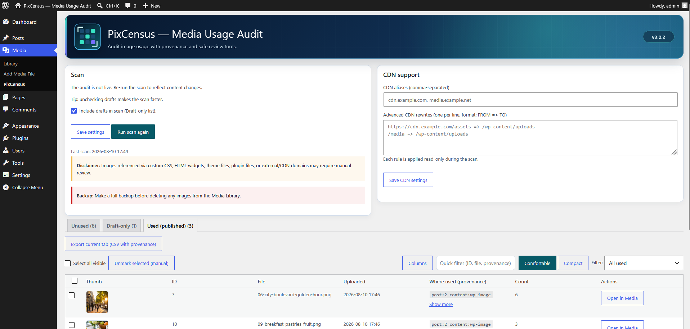

  

# PixCensus — Media Usage Audit

A non-destructive WordPress plugin for finding where images are used before cleaning up the Media Library.

## Official release

**PixCensus — Media Usage Audit 3.0.3 is the current source release.**

- **WordPress.org:** https://wordpress.org/plugins/pixcensus-media-audit/
- **GitHub release:** https://github.com/ussmarines/pixcensus-media-audit/releases/tag/v3.0.3
- **Current version:** `3.0.3`
- **WordPress:** `5.9+`
- **PHP:** `7.4+`
- **License:** GPL-2.0-or-later

For normal WordPress installations, the WordPress.org package is the recommended distribution channel. GitHub remains the source repository and provides release artifacts, checksums, attestations, development history, and issue tracking.

## What PixCensus does

PixCensus scans registered WordPress image attachments and helps classify them as:

- **Used in published content**
- **Used only in draft, pending, or scheduled content**
- **Potentially unused**

For each detected reference, PixCensus records provenance so you can review where the image was found before making a cleanup decision.

It can also report image files found in the uploads directory that are not registered WordPress attachments and export scan results to CSV.

## Key features

- Scans published content and optionally draft, pending, and scheduled content.
- Detects featured images, galleries, upload URLs, generated image sizes, site icons, custom logos, metadata, options, and term descriptions.
- Handles common builder data from Elementor, Divi, Beaver Builder, Oxygen, Bricks, SiteOrigin, and WPBakery.
- Records provenance and match counts for detected references.
- Supports reversible manual **used** markings for reviewed false negatives.
- Supports CDN host aliases and read-only path rewrite rules.
- Exports used, draft-only, and potentially unused results to CSV.
- Reports orphan image files in the WordPress uploads directory.

## Non-destructive by design

PixCensus is an **audit and review tool**, not an automatic cleanup tool.

It does **not** delete, move, rename, rewrite, or otherwise modify media files, posts, metadata, terms, or Media Library entries. It stores only its own settings, scan snapshots, manual review decisions, and temporary scan state.

Uninstalling PixCensus removes only plugin-owned data.

**Always verify results and keep a tested backup before manually deleting media.**

## Installation

### Recommended — WordPress.org

1. In WordPress, open **Plugins → Add New Plugin**.
2. Search for **PixCensus — Media Usage Audit**.
3. Install and activate the plugin.
4. Open **Media → PixCensus — Media Usage Audit**.

Official directory page:

https://wordpress.org/plugins/pixcensus-media-audit/

### GitHub release

You can also download the signed release ZIP from:

https://github.com/ussmarines/pixcensus-media-audit/releases/latest

Upload `pixcensus-media-audit.zip` from **Plugins → Add New Plugin → Upload Plugin**.

## Quick start

1. Open **Media → PixCensus — Media Usage Audit**.
2. Review the scan settings and choose whether draft content should be included.
3. Run a scan.
4. Review **Unused**, **Draft-only**, and **Used (published)** results.
5. Inspect provenance before acting on any image.
6. Mark reviewed false negatives manually when necessary or export results to CSV.

Scan results are snapshots. Run a new scan after meaningful content, media, builder, CDN, or configuration changes.

## Screenshots

### 1. Audit overview

PixCensus audit overview with scan controls, media status tabs, and CDN settings.

### 2. Published media usage

Published media usage results with thumbnails, provenance, and match counts.

### 3. Draft-only references

Draft-only media references, clearly separated from published usage.

### 4. Unused-media review

Potentially unused media review with thumbnails and direct Media Library access.

### 5. Published-use controls

Published-use overview with provenance filters and result density controls.

## Important limitations

PixCensus cannot prove that an image is safe to delete. WordPress sites can reference media in ways that are impossible to discover reliably from the database alone.

Manual review may still be required for references stored in:

- theme or plugin files;
- custom CSS or JavaScript;
- dynamically generated markup or URLs;
- external services;
- unsupported page builders or unusual metadata;
- custom or unconfigured CDN transformations.

Large sites may also reach PHP execution-time or memory limits during a synchronous scan.

## What changed in 3.0.3

Version 3.0.3 adds focused defense-in-depth hardening without changing PixCensus's non-destructive workflow:

- confines attachment and orphan-file filesystem resolution to the canonical WordPress uploads directory, including traversal and symlink escape rejection;
- expands authorization regression coverage for unauthenticated users and every standard WordPress role through Administrator across AJAX, settings, and CSV export paths;
- strengthens CSV formula neutralization against Unicode whitespace, byte-order marks, zero-width characters, and bidi/formatting controls;
- removes the repeated HTML URL unescaping pattern flagged by CodeQL from the integration test helper;
- preserves WordPress 5.9+, PHP 7.4+, multisite support, and the existing administrator-only security model.

See the complete GitHub release:

https://github.com/ussmarines/pixcensus-media-audit/releases/tag/v3.0.3

## Privacy and security

Scanning runs locally inside WordPress. PixCensus makes no remote requests, loads no remote executable code, and does not collect or transmit personal data.

Administrative screens and state-changing actions require the `manage_options` capability and protected requests. CSV formula-leading values are neutralized before export.

Scan results and CSV files may reveal filenames, paths, option names, and other site structure. Restrict them to trusted administrators.

Security reports should be submitted privately as described in [SECURITY.md](SECURITY.md).

## Development

Runtime code has no third-party dependencies. Development and QA dependencies are locked in `composer.lock` and `package-lock.json`.

The project CI covers supported PHP versions, WordPress 5.9 and current WordPress, multisite, authenticated AJAX behavior, Plugin Check, static analysis, security checks, reproducible packaging, and installation of the exact release ZIP.

Contributions should use a focused topic branch and preserve WordPress 5.9+, PHP 7.4+, WordPress Coding Standards, and the plugin's non-destructive behavior.

## License

PixCensus — Media Usage Audit is licensed under [GPL-2.0-or-later](LICENSE).
